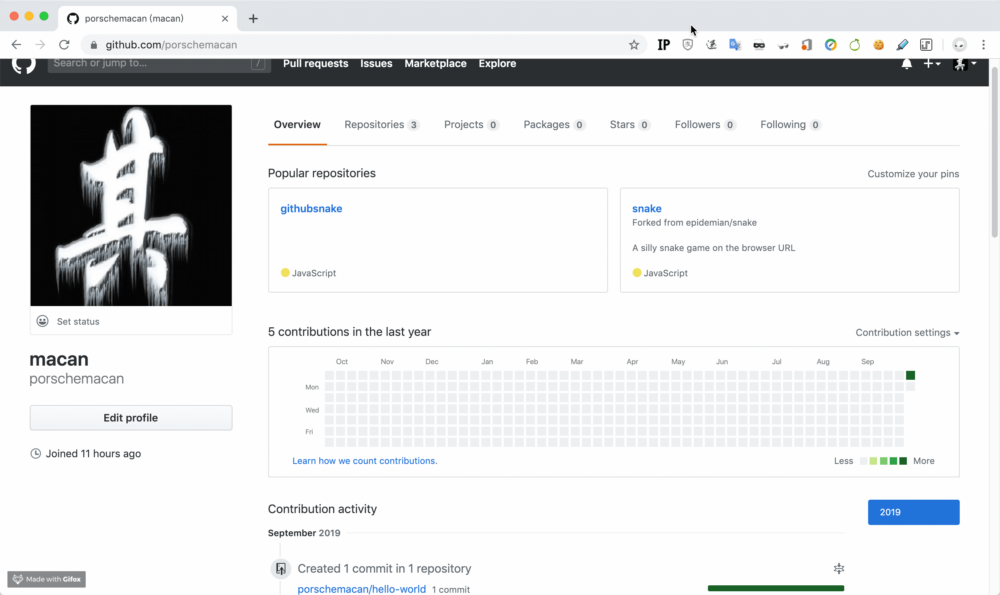
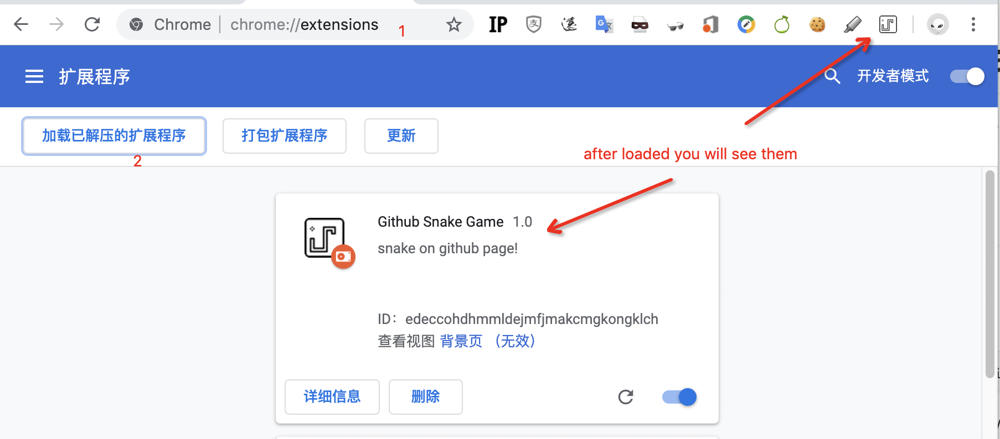
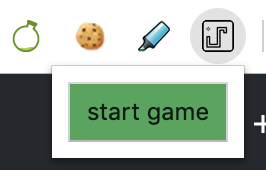

# github snake

play snake on github home page...



## install


1. clone source code

```
git clone https://github.com/porschemacan/githubsnake.git
```

2. load to chrome browser

   

   type`chrome://extensions/` to address bar, then `enter`. you will see the  plugin management page.

   press the button of load plugin, the button text in chinese is "加载已解压的扩展程序".

   then browse to the `githubsnake`  directory you just `git clone`.  and confirm it.

   you will see the icon on the right side of the address bar. it means install plugin successfully.

3. Open home page

   open your github home page, its url is `https://github.com/xxxx`

4. click the plugin icon, and click `start game` button

   

5. use WASD or the Arrows to control snake, if dead, you can repeat from step 4 or step 3.